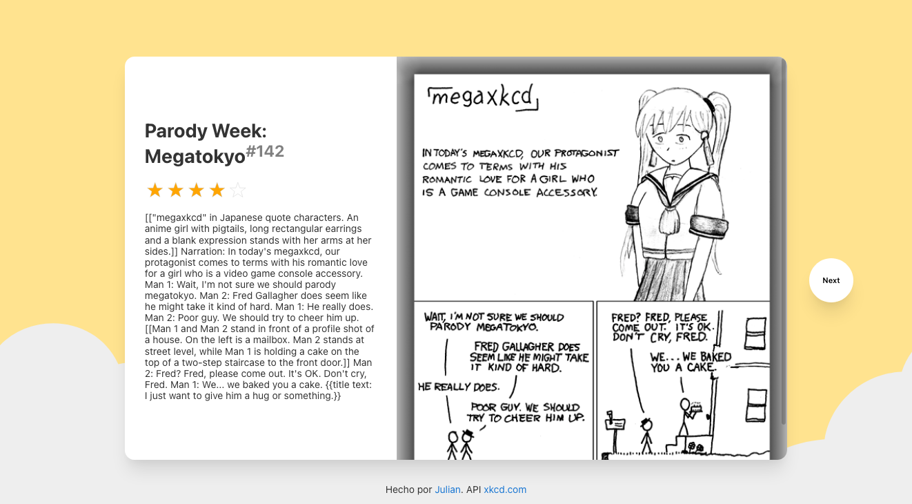

# Comics

Este proyecto está construido usando [Angular](https://github.com/angular/angular-cli) version 11.2.0. Se implementó:

- [x] [NGXS](https://www.ngxs.io/).
- [x] [SASS](https://sass-lang.com/).

## API

Se usa [XKCD](https://xkcd.com/json.html) para consultar **aleatoriamente** los comics.

## Pasos de ejecución

1. `git clone https://github.com/juliandavidmr/comics`
2. `cd comics`
3. `npm install`
4. `npm start` para correr servidor de desarrollo. Navegar a `http://localhost:4200/`

## Uso

- Dar clic en el boton `Next` para cambiar aleatoriamente el comic.
- Dar clic sobre las estrellas para calificar comic.

## Unit tests

1. `npm test`

## Ejecución de pruebas end-to-end

1. `npm run e2e`
